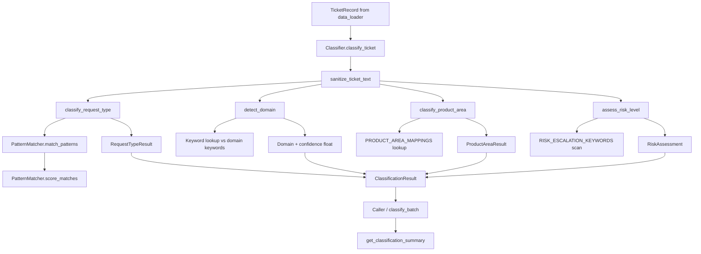
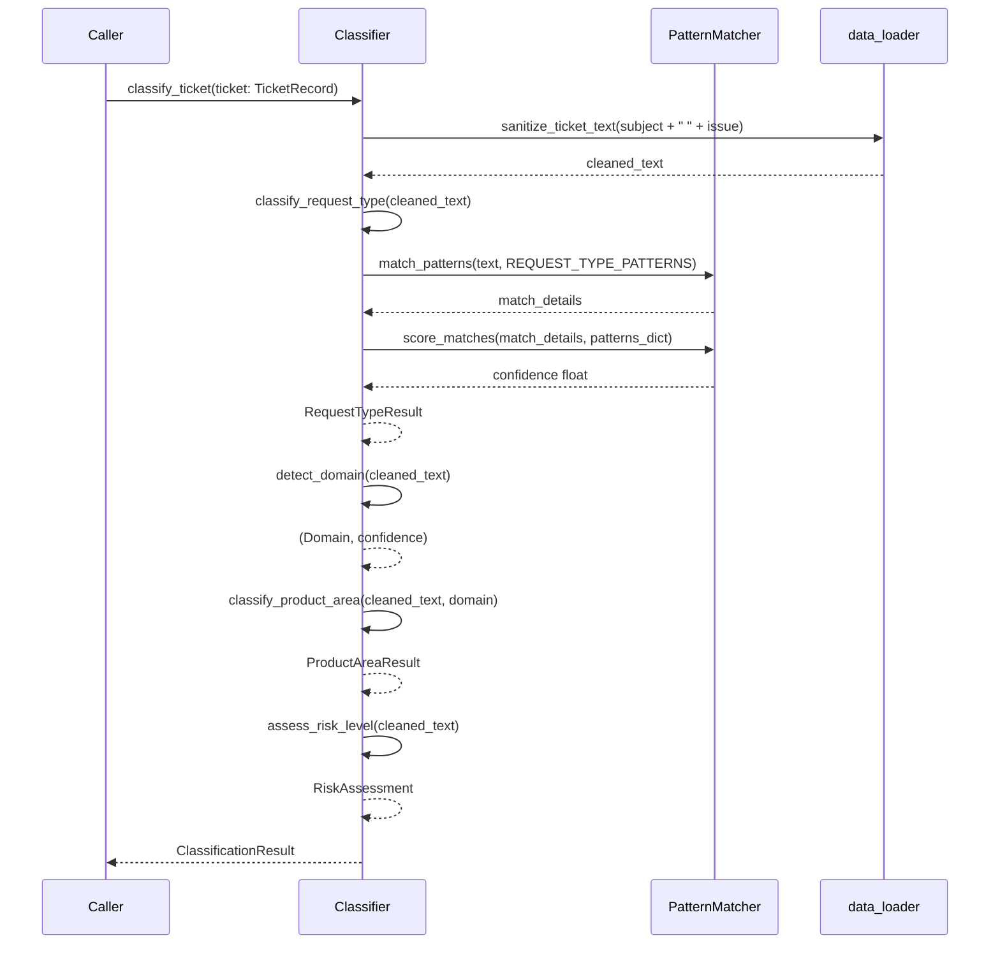
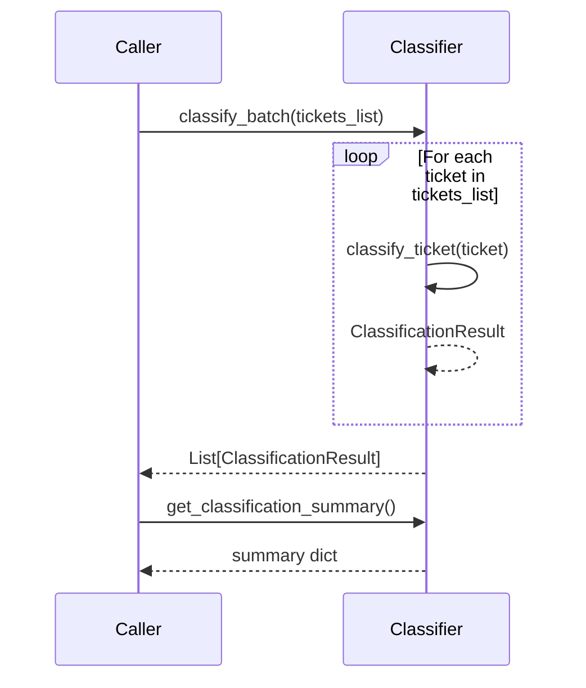

# Design Document: Support Ticket Triage Classifier

## Overview

The `classifier.py` module is the core intelligence engine of the support ticket triage system. It consumes `TicketRecord` objects produced by `data_loader.py` and applies pattern-matching and keyword-analysis techniques — with no ML dependencies — to classify each ticket across four dimensions: request type, product area, risk level, and domain. The module exposes a `Classifier` class for single-ticket and batch classification, a `PatternMatcher` utility for reusable scoring logic, and a set of module-level helper functions. All classification logic is driven by the configuration constants already defined in `config.py`.

The module integrates directly with `config.py` (`REQUEST_TYPE_PATTERNS`, `RISK_ESCALATION_KEYWORDS`, `PRODUCT_AREA_MAPPINGS`, `SUPPORTED_DOMAINS`) and `data_loader.py` (`TicketRecord`, `sanitize_ticket_text`). It has no third-party runtime dependencies beyond the Python standard library.

---

## Architecture



---

## Sequence Diagrams

### Single Ticket Classification



### Batch Classification



---

## Components and Interfaces

### Component 1: Enums

**Purpose**: Provide type-safe, exhaustive value sets for classification dimensions.

**Interface**:
```python
class RequestType(Enum):
    BUG = "bug"
    FEATURE_REQUEST = "feature_request"
    PRODUCT_ISSUE = "product_issue"
    INVALID = "invalid"

class RiskLevel(Enum):
    CRITICAL = "critical"
    HIGH = "high"
    LOW = "low"

class Domain(Enum):
    HACKERRANK = "hackerrank"
    CLAUDE = "claude"
    VISA = "visa"
    UNKNOWN = "unknown"
```

**Responsibilities**:
- Prevent magic-string bugs throughout the classification pipeline
- Enable exhaustive pattern matching in callers
- Map directly to the string constants in `config.py`

---

### Component 2: Result Dataclasses

**Purpose**: Typed, immutable value objects carrying classification output for each dimension.

**Interface**:
```python
@dataclass
class RequestTypeResult:
    type: RequestType
    confidence: float
    matched_patterns: list[str]
    def __repr__(self) -> str: ...

@dataclass
class ProductAreaResult:
    area: str
    domain: Domain
    confidence: float
    matched_keywords: list[str]
    def __repr__(self) -> str: ...

@dataclass
class RiskAssessment:
    level: RiskLevel
    confidence: float
    risk_keywords: list[str]
    reason: str
    def __repr__(self) -> str: ...

@dataclass
class ClassificationResult:
    request_type: RequestTypeResult
    product_area: ProductAreaResult
    risk: RiskAssessment
    detected_domain: Domain
    raw_text: str
    cleaned_text: str
    def to_dict(self) -> dict: ...
    def __repr__(self) -> str: ...
```

**Responsibilities**:
- Carry all classification output in a structured, inspectable form
- Provide `to_dict()` for serialisation to downstream consumers
- Expose `__repr__` for logging and debugging

---

### Component 3: PatternMatcher

**Purpose**: Reusable utility for multi-category keyword/pattern matching and confidence scoring.

**Interface**:
```python
class PatternMatcher:
    @staticmethod
    def match_patterns(text: str, patterns_dict: dict) -> dict:
        # Returns: {matched_categories, match_details, total_matches}
        ...

    @staticmethod
    def score_matches(match_details: dict, patterns_dict: dict) -> float:
        # Returns: confidence float in [0.0, 1.0]
        ...
```

**Responsibilities**:
- Perform case-insensitive substring matching of patterns against text
- Aggregate match counts per category
- Compute a normalised confidence score based on match density

---

### Component 4: Classifier

**Purpose**: Main classification engine; orchestrates all four classification dimensions for a ticket.

**Interface**:
```python
class Classifier:
    def classify_request_type(self, ticket_text: str) -> RequestTypeResult: ...
    def detect_domain(self, ticket_text: str, specified_domain: Optional[str] = None) -> Tuple[Domain, float]: ...
    def classify_product_area(self, ticket_text: str, domain: Optional[Domain] = None) -> ProductAreaResult: ...
    def assess_risk_level(self, ticket_text: str) -> RiskAssessment: ...
    def classify_ticket(self, ticket: TicketRecord) -> ClassificationResult: ...
    def classify_batch(self, tickets_list: list) -> list[ClassificationResult]: ...
    def get_classification_summary(self) -> dict: ...
```

**Responsibilities**:
- Coordinate `PatternMatcher`, config constants, and domain keyword tables
- Accumulate batch statistics across multiple `classify_ticket` calls
- Log risk-level outcomes at appropriate severity levels

---

### Component 5: Module-Level Utility Functions

**Purpose**: Stateless helpers for common text-analysis operations.

**Interface**:
```python
def infer_company_from_text(text: str) -> Optional[str]: ...
def extract_keywords(text: str, keyword_dict: dict) -> dict: ...
def score_text_length_confidence(text: str) -> float: ...
```

**Responsibilities**:
- `infer_company_from_text`: Return display name ("HackerRank", "Claude", "Visa") or None
- `extract_keywords`: Return dict of found keywords grouped by category
- `score_text_length_confidence`: Return a length-based confidence modifier

---

## Data Models

### ClassificationResult Fields

| Field             | Type                | Description                                      |
|-------------------|---------------------|--------------------------------------------------|
| `request_type`    | `RequestTypeResult` | Classified request type with confidence          |
| `product_area`    | `ProductAreaResult` | Detected product area with domain and confidence |
| `risk`            | `RiskAssessment`    | Risk level with matched keywords and reason      |
| `detected_domain` | `Domain`            | Enum value for the detected or specified domain  |
| `raw_text`        | `str`               | Original combined subject + issue text           |
| `cleaned_text`    | `str`               | Sanitized text used for classification           |

### Classification Summary Dict

```python
{
    "total_classified":  int,   # total tickets classified since init
    "by_request_type":   dict,  # {request_type_value: count}
    "by_risk_level":     dict,  # {risk_level_value: count}
    "by_domain":         dict,  # {domain_value: count}
    "high_risk_count":   int,   # count of CRITICAL + HIGH risk tickets
}
```

### Domain Keyword Tables (internal to Classifier)

| Domain      | Keywords                                                    |
|-------------|-------------------------------------------------------------|
| HackerRank  | "assessment", "test", "contest", "hackerrank", "coding challenge" |
| Claude      | "claude", "api", "model", "tokens", "conversation"          |
| Visa        | "visa", "card", "payment", "refund", "transaction"          |

---

## Error Handling

### Error Scenario 1: Empty or Whitespace-Only Ticket Text

**Condition**: `classify_request_type`, `detect_domain`, or `assess_risk_level` receives empty text.
**Response**: Returns a result with `RequestType.INVALID` / `Domain.UNKNOWN` / `RiskLevel.LOW` and confidence `0.0`.
**Recovery**: Caller receives a valid result object; no exception is raised.

### Error Scenario 2: Unknown Domain in classify_product_area

**Condition**: `classify_product_area` is called with `Domain.UNKNOWN`.
**Response**: Returns `ProductAreaResult("general", Domain.UNKNOWN, 0.3, [])`.
**Recovery**: Automatic — caller receives a low-confidence fallback result.

### Error Scenario 3: Invalid TicketRecord Passed to classify_ticket

**Condition**: `classify_ticket` receives a non-`TicketRecord` argument.
**Response**: Raises `TypeError` with a descriptive message.
**Recovery**: Caller must pass a valid `TicketRecord` instance.

### Error Scenario 4: Empty Batch

**Condition**: `classify_batch` receives an empty list.
**Response**: Returns an empty list without raising.
**Recovery**: Automatic — caller receives `[]`.

---

## Testing Strategy

### Unit Testing Approach

Tests are organised into eight classes in `test_classifier.py` (20+ tests total):

- **TestEnums** (3 tests): Verify enum values, membership, and string representations.
- **TestRequestTypeClassification** (6 tests): bug, feature_request, product_issue, invalid/empty, priority ordering, case-insensitivity.
- **TestDomainDetection** (6 tests): HackerRank keywords, Claude keywords, Visa keywords, specified domain override, unknown domain, confidence values.
- **TestProductAreaClassification** (7 tests): Each domain with matching keywords, fallback to first area, UNKNOWN domain returns "general".
- **TestRiskAssessment** (6 tests): CRITICAL (score≥3), HIGH (score=2), HIGH (score=1), LOW (no keywords), logging level, confidence values.
- **TestClassificationResult** (3 tests): `to_dict()` structure, `__repr__`, full pipeline via `classify_ticket`.
- **TestBatchClassification** (3 tests): Empty batch, single ticket, multiple tickets with summary.
- **TestUtilityFunctions** (3 tests): `infer_company_from_text`, `extract_keywords`, `score_text_length_confidence`.

### Property-Based Testing Approach

**Property Test Library**: `hypothesis`

Six properties verified in `test_classifier_properties.py`:

1. **Classification result validity**: Every `ClassificationResult` has non-None fields and valid enum values.
2. **Confidence bounds**: All confidence values are in `[0.0, 1.0]` with no NaN or infinity.
3. **Risk detection consistency**: Tickets containing CRITICAL keywords always produce CRITICAL or HIGH risk.
4. **Product area validity**: Returned area is always a member of `PRODUCT_AREA_MAPPINGS[domain]` (or "general" for UNKNOWN).
5. **Classification consistency**: Classifying the same text twice always produces identical results (deterministic).
6. **Batch consistency**: `classify_batch([t])` produces the same result as `classify_ticket(t)` for any single ticket.

### Integration Testing Approach

The existing `inputs/sample_support_tickets.csv` fixture exercises the full pipeline: `load_tickets` → `Classifier.classify_batch` → `get_classification_summary`, verifying that real-world ticket data produces valid `ClassificationResult` objects across all three domains.

---

## Performance Considerations

- All classification methods perform linear scans over small, fixed-size keyword lists (≤ 10 entries per category). For the expected ticket volumes, this is O(n × k) where k is constant and small.
- `classify_batch` processes tickets sequentially; for very large batches (> 10k tickets), callers may parallelise using `concurrent.futures.ThreadPoolExecutor`.
- `PatternMatcher.match_patterns` compiles no regex at call time — all matching is plain `str.lower()` substring search, which is fast and avoids regex compilation overhead.

---

## Security Considerations

- No user-supplied data is executed or evaluated; all input is treated as plain text for substring matching.
- The module does not write to disk, make network calls, or execute subprocesses.
- Logging uses `%`-style formatting (not f-strings) to prevent log injection.
- Pattern lists and keyword tables are read-only at runtime; no mutation of config data occurs.

---

## Dependencies

| Dependency     | Source          | Purpose                                              |
|----------------|-----------------|------------------------------------------------------|
| `re`           | Python stdlib   | Regex for text preprocessing                         |
| `logging`      | Python stdlib   | Structured logging with console handler              |
| `enum`         | Python stdlib   | `Enum` base class for `RequestType`, `RiskLevel`, `Domain` |
| `dataclasses`  | Python stdlib   | `@dataclass` decorator for result types              |
| `typing`       | Python stdlib   | `Optional`, `Tuple`, `List` type annotations         |
| `config`       | Local module    | `REQUEST_TYPE_PATTERNS`, `RISK_ESCALATION_KEYWORDS`, `PRODUCT_AREA_MAPPINGS`, `SUPPORTED_DOMAINS` |
| `data_loader`  | Local module    | `TicketRecord`, `sanitize_ticket_text`               |
| `pytest`       | Test dependency | Unit test runner                                     |
| `hypothesis`   | Test dependency | Property-based test generation                       |

---

## Key Functions with Formal Specifications

### `PatternMatcher.match_patterns(text, patterns_dict)`

**Preconditions:**
- `text` is a string (may be empty)
- `patterns_dict` is a non-empty dict mapping category strings to lists of pattern strings

**Postconditions:**
- Returns a dict with keys: `matched_categories` (list), `match_details` (dict), `total_matches` (int)
- `matched_categories` contains only keys from `patterns_dict`
- `total_matches` equals the sum of all per-category match counts
- `match_details[cat]` is a list of patterns from `patterns_dict[cat]` that appear in `text.lower()`
- Empty `text` returns `{matched_categories: [], match_details: {}, total_matches: 0}`

**Loop Invariants:**
- For each category processed: `total_matches` reflects all categories checked so far

---

### `Classifier.classify_request_type(ticket_text)`

**Preconditions:**
- `ticket_text` is a string

**Postconditions:**
- Returns a `RequestTypeResult` with a valid `RequestType` enum value
- `confidence` is in `[0.0, 1.0]`
- `matched_patterns` is a list of strings (may be empty)
- Empty text returns `RequestType.INVALID` with confidence `0.0`
- Non-empty text with no matches returns `RequestType.PRODUCT_ISSUE` with confidence `0.5`
- Confidence values: BUG=0.9, FEATURE_REQUEST=0.85, PRODUCT_ISSUE=0.75, default=0.5

**Loop Invariants:** N/A (delegated to PatternMatcher)

---

### `Classifier.detect_domain(ticket_text, specified_domain=None)`

**Preconditions:**
- `ticket_text` is a string
- `specified_domain` is `None` or a string matching a `Domain` enum value

**Postconditions:**
- Returns `(Domain, float)` tuple
- Confidence is in `[0.0, 1.0]`
- If `specified_domain` is provided: returns `(Domain[specified_domain.upper()], 1.0)`
- If keywords match: returns matched domain with confidence `0.85`
- If no keywords match: returns `(Domain.UNKNOWN, 0.3)`

**Loop Invariants:** N/A (linear scan over fixed keyword tables)

---

### `Classifier.assess_risk_level(ticket_text)`

**Preconditions:**
- `ticket_text` is a string

**Postconditions:**
- Returns a `RiskAssessment` with a valid `RiskLevel` enum value
- `confidence` is in `[0.0, 1.0]`
- `risk_keywords` is a list of matched keyword strings
- Score ≥ 3 → `CRITICAL`, confidence `1.0`; logs WARNING
- Score = 2 → `HIGH`, confidence `0.95`; logs INFO
- Score = 1 → `HIGH`, confidence `0.8`; logs INFO
- Score = 0 → `LOW`, confidence `0.9`; logs DEBUG

**Loop Invariants:**
- `score` reflects the count of all risk keyword categories matched so far

---

## Algorithmic Pseudocode

### Main Classification Algorithm

```pascal
ALGORITHM Classifier.classify_ticket(ticket)
INPUT: ticket: TicketRecord
OUTPUT: result: ClassificationResult

BEGIN
  ASSERT ticket IS TicketRecord

  full_text ← ticket.subject + " " + ticket.issue
  cleaned_text ← sanitize_ticket_text(full_text)

  request_type_result ← classify_request_type(cleaned_text)
  domain, domain_confidence ← detect_domain(cleaned_text)
  product_area_result ← classify_product_area(cleaned_text, domain)
  risk_result ← assess_risk_level(cleaned_text)

  result ← ClassificationResult(
    request_type   = request_type_result,
    product_area   = product_area_result,
    risk           = risk_result,
    detected_domain = domain,
    raw_text       = full_text,
    cleaned_text   = cleaned_text
  )

  self._update_summary_stats(result)

  RETURN result
END
```

### Pattern Matching Algorithm

```pascal
ALGORITHM PatternMatcher.match_patterns(text, patterns_dict)
INPUT: text: string, patterns_dict: dict[str, list[str]]
OUTPUT: result: dict

BEGIN
  IF text IS empty THEN
    RETURN {matched_categories: [], match_details: {}, total_matches: 0}
  END IF

  lower_text ← text.lower()
  match_details ← {}
  total_matches ← 0

  FOR each (category, patterns) IN patterns_dict DO
    // Loop invariant: total_matches reflects all categories processed so far
    category_matches ← []
    FOR each pattern IN patterns DO
      IF pattern.lower() IN lower_text THEN
        category_matches.append(pattern)
        total_matches ← total_matches + 1
      END IF
    END FOR
    IF category_matches IS NOT empty THEN
      match_details[category] ← category_matches
    END IF
  END FOR

  matched_categories ← keys(match_details)

  RETURN {
    matched_categories: matched_categories,
    match_details:      match_details,
    total_matches:      total_matches
  }
END
```

### Risk Assessment Algorithm

```pascal
ALGORITHM Classifier.assess_risk_level(ticket_text)
INPUT: ticket_text: string
OUTPUT: assessment: RiskAssessment

BEGIN
  lower_text ← ticket_text.lower()
  score ← 0
  found_keywords ← []

  FOR each (category, keywords) IN RISK_ESCALATION_KEYWORDS DO
    // Loop invariant: score reflects all categories checked so far
    FOR each keyword IN keywords DO
      IF keyword.lower() IN lower_text THEN
        score ← score + 1
        found_keywords.append(keyword)
        BREAK  // count each category at most once
      END IF
    END FOR
  END FOR

  IF score >= 3 THEN
    level ← CRITICAL; confidence ← 1.0
    LOG WARNING "CRITICAL risk ticket detected"
  ELSE IF score == 2 THEN
    level ← HIGH; confidence ← 0.95
    LOG INFO "HIGH risk ticket detected"
  ELSE IF score == 1 THEN
    level ← HIGH; confidence ← 0.8
    LOG INFO "HIGH risk ticket detected"
  ELSE
    level ← LOW; confidence ← 0.9
    LOG DEBUG "LOW risk ticket"
  END IF

  reason ← build_reason_string(level, found_keywords)

  RETURN RiskAssessment(level, confidence, found_keywords, reason)
END
```

### Domain Detection Algorithm

```pascal
ALGORITHM Classifier.detect_domain(ticket_text, specified_domain=None)
INPUT: ticket_text: string, specified_domain: string or None
OUTPUT: (domain: Domain, confidence: float)

BEGIN
  IF specified_domain IS NOT None THEN
    domain ← Domain[specified_domain.upper()]
    RETURN (domain, 1.0)
  END IF

  lower_text ← ticket_text.lower()

  DOMAIN_KEYWORDS ← {
    Domain.HACKERRANK: ["assessment", "test", "contest", "hackerrank", "coding challenge"],
    Domain.CLAUDE:     ["claude", "api", "model", "tokens", "conversation"],
    Domain.VISA:       ["visa", "card", "payment", "refund", "transaction"]
  }

  best_domain ← Domain.UNKNOWN
  best_count ← 0

  FOR each (domain, keywords) IN DOMAIN_KEYWORDS DO
    count ← 0
    FOR each keyword IN keywords DO
      IF keyword IN lower_text THEN
        count ← count + 1
      END IF
    END FOR
    IF count > best_count THEN
      best_count ← count
      best_domain ← domain
    END IF
  END FOR

  IF best_domain == Domain.UNKNOWN THEN
    RETURN (Domain.UNKNOWN, 0.3)
  ELSE
    RETURN (best_domain, 0.85)
  END IF
END
```

### Product Area Classification Algorithm

```pascal
ALGORITHM Classifier.classify_product_area(ticket_text, domain=None)
INPUT: ticket_text: string, domain: Domain or None
OUTPUT: result: ProductAreaResult

BEGIN
  IF domain IS None OR domain == Domain.UNKNOWN THEN
    RETURN ProductAreaResult("general", Domain.UNKNOWN, 0.3, [])
  END IF

  domain_key ← domain.value  // e.g. "hackerrank"
  areas ← PRODUCT_AREA_MAPPINGS[domain_key]
  lower_text ← ticket_text.lower()
  matched_keywords ← []

  FOR each area IN areas DO
    area_keyword ← area.lower().replace("_", " ")
    IF area_keyword IN lower_text THEN
      matched_keywords.append(area)
      RETURN ProductAreaResult(area, domain, 0.85, matched_keywords)
    END IF
  END FOR

  // No match — fall back to first area with lower confidence
  RETURN ProductAreaResult(areas[0], domain, 0.5, [])
END
```

### Confidence Scoring Algorithm

```pascal
ALGORITHM PatternMatcher.score_matches(match_details, patterns_dict)
INPUT: match_details: dict[str, list[str]], patterns_dict: dict[str, list[str]]
OUTPUT: confidence: float

BEGIN
  IF match_details IS empty THEN
    RETURN 0.0
  END IF

  total_patterns ← sum(len(patterns) FOR patterns IN patterns_dict.values())
  total_matched  ← sum(len(matches)  FOR matches  IN match_details.values())

  IF total_patterns == 0 THEN
    RETURN 0.0
  END IF

  raw_score ← total_matched / total_patterns
  confidence ← min(1.0, raw_score)

  RETURN confidence
END
```
