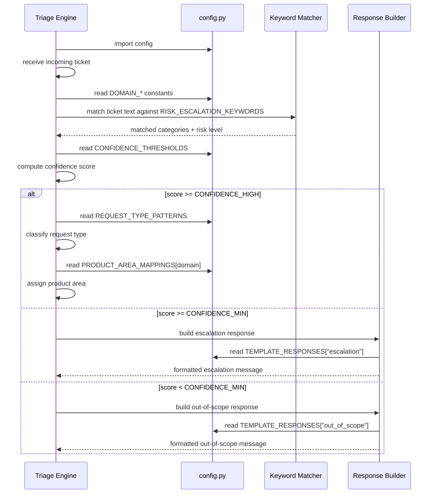
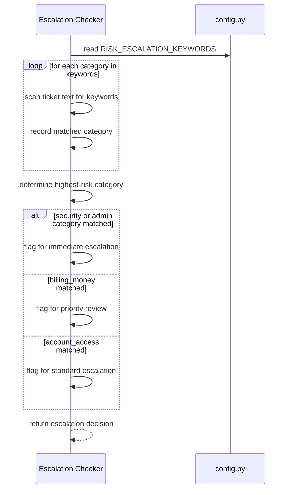

# Design Document: Support Ticket Triage Configuration

## Overview

This feature delivers a centralized `config.py` module that drives a support ticket triage system. It defines all static configuration — domain constants, risk escalation keywords, request-type patterns, product-area mappings, confidence thresholds, and template responses — in one importable file, keeping business logic separate from configuration data.

The configuration is structured so that any triage engine can import it and immediately classify, escalate, or respond to incoming support tickets across three supported domains: HackerRank, Claude, and Visa. All mappings use plain Python dictionaries for easy extension and readability.

## Architecture

```mermaid
graph TD
    A[config.py Module] --> B[Domain Constants]
    A --> C[Risk Escalation Keywords]
    A --> D[Request Type Patterns]
    A --> E[Product Area Mappings]
    A --> F[Confidence Thresholds]
    A --> G[Template Responses]

    B --> B1[DOMAIN_HACKERRANK]
    B --> B2[DOMAIN_CLAUDE]
    B --> B3[DOMAIN_VISA]

    C --> C1[account_access]
    C --> C2[billing_money]
    C --> C3[security]
    C --> C4[admin]

    D --> D1[bug]
    D --> D2[feature_request]
    D --> D3[product_issue]

    E --> E1[HackerRank Areas]
    E --> E2[Claude Areas]
    E --> E3[Visa Areas]

    F --> F1[CONFIDENCE_MIN = 0.6]
    F --> F2[CONFIDENCE_HIGH = 0.8]

    G --> G1[escalation_template]
    G --> G2[out_of_scope_template]
```



## Sequence Diagrams

### Ticket Classification Flow



### Escalation Decision Flow



## Components and Interfaces

### Component 1: Domain Constants

**Purpose**: Provide canonical string identifiers for each supported domain, preventing magic strings throughout the codebase.

**Interface**:
```python
DOMAIN_HACKERRANK: str = "hackerrank"
DOMAIN_CLAUDE: str = "claude"
DOMAIN_VISA: str = "visa"

SUPPORTED_DOMAINS: list[str] = [DOMAIN_HACKERRANK, DOMAIN_CLAUDE, DOMAIN_VISA]
```

**Responsibilities**:
- Serve as the single source of truth for domain identifiers
- Enable `domain in SUPPORTED_DOMAINS` checks in triage logic
- Prevent typo-related bugs from hardcoded strings

---

### Component 2: Risk Escalation Keywords

**Purpose**: Map risk categories to lists of trigger keywords that indicate a ticket needs escalation.

**Interface**:
```python
RISK_ESCALATION_KEYWORDS: dict[str, list[str]] = {
    "account_access": [...],
    "billing_money": [...],
    "security": [...],
    "admin": [...],
}
```

**Responsibilities**:
- Define the complete vocabulary for each risk category
- Support case-insensitive substring matching by triage engines
- Allow new categories to be added without changing triage logic

---

### Component 3: Request Type Patterns

**Purpose**: Map request type labels to lists of indicator phrases used to classify the nature of a ticket.

**Interface**:
```python
REQUEST_TYPE_PATTERNS: dict[str, list[str]] = {
    "bug": [...],
    "feature_request": [...],
    "product_issue": [...],
}
```

**Responsibilities**:
- Provide classification signals for each request type
- Support pattern matching against ticket subject and body text
- Remain domain-agnostic (applicable across all three domains)

---

### Component 4: Product Area Mappings

**Purpose**: Map each domain to its list of recognized product areas, enabling accurate routing.

**Interface**:
```python
PRODUCT_AREA_MAPPINGS: dict[str, list[str]] = {
    "hackerrank": [...],
    "claude": [...],
    "visa": [...],
}
```

**Responsibilities**:
- Define valid product areas per domain
- Support area detection from ticket content
- Enable routing decisions in the triage engine

---

### Component 5: Confidence Thresholds

**Purpose**: Define numeric thresholds that govern triage decision boundaries.

**Interface**:
```python
CONFIDENCE_MIN: float = 0.6
CONFIDENCE_HIGH: float = 0.8
```

**Responsibilities**:
- Set the minimum confidence required to act on a classification
- Distinguish between high-confidence routing and escalation-required cases
- Provide a single place to tune triage sensitivity

---

### Component 6: Template Responses

**Purpose**: Provide pre-written, professional response templates for escalation and out-of-scope scenarios.

**Interface**:
```python
TEMPLATE_RESPONSES: dict[str, str] = {
    "escalation": "...",
    "out_of_scope": "...",
}
```

**Responsibilities**:
- Ensure consistent, professional tone across automated responses
- Support string formatting with ticket-specific placeholders
- Separate response copy from triage logic

---

## Data Models

### Domain Identifier

```python
# A domain identifier is one of the DOMAIN_* string constants
DomainId = str  # one of: "hackerrank", "claude", "visa"
```

**Validation Rules**:
- Must be a non-empty string
- Must be a member of `SUPPORTED_DOMAINS`

---

### Risk Category

```python
# A risk category key from RISK_ESCALATION_KEYWORDS
RiskCategory = str  # one of: "account_access", "billing_money", "security", "admin"
```

**Validation Rules**:
- Must be a key present in `RISK_ESCALATION_KEYWORDS`
- Keywords list for each category must be non-empty

---

### Request Type

```python
# A request type key from REQUEST_TYPE_PATTERNS
RequestType = str  # one of: "bug", "feature_request", "product_issue"
```

**Validation Rules**:
- Must be a key present in `REQUEST_TYPE_PATTERNS`
- Pattern list for each type must be non-empty

---

### Confidence Score

```python
# A float in [0.0, 1.0] representing classification confidence
ConfidenceScore = float
```

**Validation Rules**:
- Must satisfy `0.0 <= score <= 1.0`
- `score >= CONFIDENCE_HIGH` → high-confidence routing
- `CONFIDENCE_MIN <= score < CONFIDENCE_HIGH` → escalation required
- `score < CONFIDENCE_MIN` → out-of-scope response

---

## Algorithmic Pseudocode

### Main Triage Algorithm

```python
def triage_ticket(ticket_text: str, domain: str) -> TriageResult:
    """
    Preconditions:
        - ticket_text is a non-empty string
        - domain is a member of SUPPORTED_DOMAINS

    Postconditions:
        - Returns a TriageResult with action, category, and response
        - If any security/admin keyword matched, action is "immediate_escalation"
        - If confidence >= CONFIDENCE_HIGH, action is "route"
        - If CONFIDENCE_MIN <= confidence < CONFIDENCE_HIGH, action is "escalate"
        - If confidence < CONFIDENCE_MIN, action is "out_of_scope"

    Loop Invariants (keyword scan loop):
        - matched_categories contains only valid RiskCategory keys
        - All previously scanned categories have been fully evaluated
    """
    # Step 1: Scan for risk keywords
    matched_categories = []
    for category, keywords in RISK_ESCALATION_KEYWORDS.items():
        # Loop invariant: matched_categories only grows with valid categories
        for keyword in keywords:
            if keyword.lower() in ticket_text.lower():
                matched_categories.append(category)
                break

    # Step 2: Compute confidence score
    confidence = compute_confidence(ticket_text, matched_categories)

    # Step 3: Branch on confidence
    if confidence >= CONFIDENCE_HIGH:
        request_type = classify_request_type(ticket_text)
        product_area = detect_product_area(ticket_text, domain)
        return TriageResult(action="route", request_type=request_type,
                            product_area=product_area, confidence=confidence)
    elif confidence >= CONFIDENCE_MIN:
        response = TEMPLATE_RESPONSES["escalation"].format(domain=domain)
        return TriageResult(action="escalate", response=response,
                            categories=matched_categories, confidence=confidence)
    else:
        response = TEMPLATE_RESPONSES["out_of_scope"].format(domain=domain)
        return TriageResult(action="out_of_scope", response=response,
                            confidence=confidence)
```

### Request Type Classification

```python
def classify_request_type(ticket_text: str) -> str:
    """
    Preconditions:
        - ticket_text is a non-empty string

    Postconditions:
        - Returns a key from REQUEST_TYPE_PATTERNS
        - Returns "product_issue" as default if no pattern matches

    Loop Invariants:
        - best_match always holds the type with the highest match count seen so far
    """
    scores: dict[str, int] = {rtype: 0 for rtype in REQUEST_TYPE_PATTERNS}

    for request_type, patterns in REQUEST_TYPE_PATTERNS.items():
        for pattern in patterns:
            # Loop invariant: scores[request_type] reflects all patterns checked so far
            if pattern.lower() in ticket_text.lower():
                scores[request_type] += 1

    best_match = max(scores, key=lambda k: scores[k])
    return best_match if scores[best_match] > 0 else "product_issue"
```

### Product Area Detection

```python
def detect_product_area(ticket_text: str, domain: str) -> str:
    """
    Preconditions:
        - ticket_text is a non-empty string
        - domain is a member of SUPPORTED_DOMAINS

    Postconditions:
        - Returns a string from PRODUCT_AREA_MAPPINGS[domain]
        - Returns first area in domain's list as default if no match found

    Loop Invariants:
        - first_area always holds the first element of PRODUCT_AREA_MAPPINGS[domain]
    """
    areas = PRODUCT_AREA_MAPPINGS[domain]
    first_area = areas[0]  # default fallback

    for area in areas:
        # Loop invariant: first_area is always a valid area for this domain
        if area.lower().replace("_", " ") in ticket_text.lower():
            return area

    return first_area
```

---

## Key Functions with Formal Specifications

### `triage_ticket(ticket_text, domain)`

```python
def triage_ticket(ticket_text: str, domain: str) -> TriageResult: ...
```

**Preconditions:**
- `ticket_text` is a non-empty string
- `domain` is a member of `SUPPORTED_DOMAINS`
- All config constants are loaded and non-empty

**Postconditions:**
- Returns a `TriageResult` with a non-null `action` field
- `action` is one of: `"route"`, `"escalate"`, `"out_of_scope"`, `"immediate_escalation"`
- If `"security"` or `"admin"` in matched categories → `action == "immediate_escalation"`
- If `confidence >= CONFIDENCE_HIGH` → `action == "route"` with valid `product_area`
- If `CONFIDENCE_MIN <= confidence < CONFIDENCE_HIGH` → `action == "escalate"` with formatted response
- If `confidence < CONFIDENCE_MIN` → `action == "out_of_scope"` with formatted response

**Loop Invariants:**
- During keyword scan: `matched_categories` contains only valid `RiskCategory` keys
- Each category appears at most once in `matched_categories`

---

### `classify_request_type(ticket_text)`

```python
def classify_request_type(ticket_text: str) -> str: ...
```

**Preconditions:**
- `ticket_text` is a non-empty string
- `REQUEST_TYPE_PATTERNS` is non-empty

**Postconditions:**
- Returns a key from `REQUEST_TYPE_PATTERNS`
- Returns `"product_issue"` when no patterns match
- Return value is deterministic for the same input

**Loop Invariants:**
- `scores` dict always contains exactly the keys from `REQUEST_TYPE_PATTERNS`
- `scores[k]` is non-negative for all keys `k`

---

### `detect_product_area(ticket_text, domain)`

```python
def detect_product_area(ticket_text: str, domain: str) -> str: ...
```

**Preconditions:**
- `ticket_text` is a non-empty string
- `domain` is a key in `PRODUCT_AREA_MAPPINGS`
- `PRODUCT_AREA_MAPPINGS[domain]` is a non-empty list

**Postconditions:**
- Returns a string that is a member of `PRODUCT_AREA_MAPPINGS[domain]`
- Never returns `None` or an empty string
- Falls back to `PRODUCT_AREA_MAPPINGS[domain][0]` when no match found

**Loop Invariants:**
- The fallback `first_area` is always a valid area for the given domain

---

## Example Usage

```python
# Import the config module
import config

# Access domain constants
print(config.DOMAIN_HACKERRANK)   # "hackerrank"
print(config.SUPPORTED_DOMAINS)   # ["hackerrank", "claude", "visa"]

# Check if a ticket contains escalation keywords
ticket = "I cannot access my account and suspect it was hacked"
for category, keywords in config.RISK_ESCALATION_KEYWORDS.items():
    for kw in keywords:
        if kw in ticket.lower():
            print(f"Risk category matched: {category}")
            break

# Use confidence thresholds
confidence_score = 0.75
if confidence_score >= config.CONFIDENCE_HIGH:
    print("High confidence — route directly")
elif confidence_score >= config.CONFIDENCE_MIN:
    print("Medium confidence — escalate for review")
else:
    print("Low confidence — out of scope")

# Format a template response
response = config.TEMPLATE_RESPONSES["escalation"].format(
    ticket_id="TKT-1234",
    domain="HackerRank",
    agent_name="Support Team"
)
print(response)

# Look up product areas for a domain
areas = config.PRODUCT_AREA_MAPPINGS[config.DOMAIN_VISA]
print(f"Visa product areas: {areas}")
```

---

## Error Handling

### Error Scenario 1: Unknown Domain

**Condition**: A triage engine passes a domain string not in `SUPPORTED_DOMAINS`
**Response**: `PRODUCT_AREA_MAPPINGS[unknown_domain]` raises `KeyError`
**Recovery**: Triage engine should validate `domain in config.SUPPORTED_DOMAINS` before calling area detection; config module itself does not raise — callers are responsible for validation

---

### Error Scenario 2: Empty Keyword Lists

**Condition**: A risk category in `RISK_ESCALATION_KEYWORDS` has an empty list
**Response**: That category will never match, silently reducing escalation coverage
**Recovery**: Add a startup assertion: `assert all(v for v in RISK_ESCALATION_KEYWORDS.values())`

---

### Error Scenario 3: Template Formatting Errors

**Condition**: A template response is formatted with missing or misnamed placeholders
**Response**: Python raises `KeyError` at format time
**Recovery**: Document all required placeholder keys in comments adjacent to each template; callers must supply all keys

---

### Error Scenario 4: Confidence Score Out of Range

**Condition**: A triage engine computes a confidence score outside `[0.0, 1.0]`
**Response**: Threshold comparisons still work mathematically but semantics are violated
**Recovery**: Triage engine should clamp scores: `confidence = max(0.0, min(1.0, raw_score))`

---

## Testing Strategy

### Unit Testing Approach

Each configuration section should be validated with unit tests that assert:
- All domain constants are non-empty strings and members of `SUPPORTED_DOMAINS`
- All keyword lists are non-empty
- All request type pattern lists are non-empty
- All product area lists are non-empty for each domain
- `CONFIDENCE_MIN < CONFIDENCE_HIGH` and both are in `[0.0, 1.0]`
- All template response strings contain expected placeholder keys

### Property-Based Testing Approach

**Property Test Library**: `hypothesis` (Python)

Key properties to test:
- For any ticket text containing a keyword from `RISK_ESCALATION_KEYWORDS[cat]`, the keyword scanner must detect category `cat`
- For any domain in `SUPPORTED_DOMAINS`, `PRODUCT_AREA_MAPPINGS[domain]` returns a non-empty list
- `classify_request_type` always returns a key present in `REQUEST_TYPE_PATTERNS`
- Template formatting with all required keys never raises an exception

### Integration Testing Approach

- Test the full triage pipeline with sample tickets for each domain
- Verify that security/admin keyword matches trigger immediate escalation regardless of confidence score
- Verify that template responses render correctly with realistic ticket metadata

---

## Performance Considerations

- All config data is module-level — loaded once at import time, zero per-request overhead
- Keyword lists are small enough that linear scan is negligible; no indexing needed
- If keyword lists grow significantly (>500 entries per category), consider compiling them into a `set` or `re` pattern at import time for O(1) or compiled-regex lookup

---

## Security Considerations

- The config file contains no secrets, credentials, or PII — safe to commit to version control
- Template responses must not include user-supplied data directly; callers are responsible for sanitizing any values interpolated into templates
- The `admin` escalation category should be treated with highest priority; any match should bypass normal confidence thresholds

---

## Dependencies

- Python 3.9+ (for `dict[str, list[str]]` type hint syntax in comments)
- No third-party dependencies — `config.py` uses only Python built-ins
- `hypothesis` library required for property-based tests (dev dependency only)

---

## Correctness Properties

*A property is a characteristic or behavior that should hold true across all valid executions of a system — essentially, a formal statement about what the system should do. Properties serve as the bridge between human-readable specifications and machine-verifiable correctness guarantees.*

### Property 1: Domain constants are non-empty strings

*For any* domain constant defined in the Config_Module (`DOMAIN_HACKERRANK`, `DOMAIN_CLAUDE`, `DOMAIN_VISA`), the value must be a non-empty string and must be a member of `SUPPORTED_DOMAINS`.

**Validates: Requirements 1.1, 1.2, 1.3, 1.4**

---

### Property 2: All keyword lists are non-empty

*For any* category key in `RISK_ESCALATION_KEYWORDS`, the associated list of keywords must contain at least one entry, ensuring no risk category silently fails to match.

**Validates: Requirements 2.1, 2.7**

---

### Property 3: Keyword detection is comprehensive

*For any* keyword `k` in `RISK_ESCALATION_KEYWORDS[category]` and *for any* ticket text that contains `k` (case-insensitively), a keyword scanner iterating over `RISK_ESCALATION_KEYWORDS` must detect `category` as a match.

**Validates: Requirements 2.6**

---

### Property 4: Request type classification always returns a valid key

*For any* non-empty ticket text string, `classify_request_type` must return a value that is a key present in `REQUEST_TYPE_PATTERNS`. The function must never return `None`, an empty string, or a value outside the defined request types.

**Validates: Requirements 3.5, 3.6**

---

### Property 5: Product area detection always returns a valid area

*For any* non-empty ticket text and *for any* domain in `SUPPORTED_DOMAINS`, `detect_product_area` must return a string that is a member of `PRODUCT_AREA_MAPPINGS[domain]`. The function must never return `None` or an empty string, and must fall back to the first area when no keyword matches.

**Validates: Requirements 4.5, 4.6**

---

### Property 6: Template formatting never raises on valid placeholders

*For any* template key in `TEMPLATE_RESPONSES` and *for any* dictionary of placeholder values that includes all documented required keys, calling `.format(**placeholders)` on the template string must complete without raising a `KeyError` or any other exception.

**Validates: Requirements 6.4, 6.5**

---

### Property 7: All pattern lists are non-empty

*For any* request type key in `REQUEST_TYPE_PATTERNS`, the associated list of indicator phrases must contain at least one entry, ensuring every request type has classification signals.

**Validates: Requirements 3.1**

---

### Property 8: All product area lists are non-empty

*For any* domain in `SUPPORTED_DOMAINS`, `PRODUCT_AREA_MAPPINGS[domain]` must return a non-empty list, ensuring every domain has at least one valid routing destination.

**Validates: Requirements 4.1**
