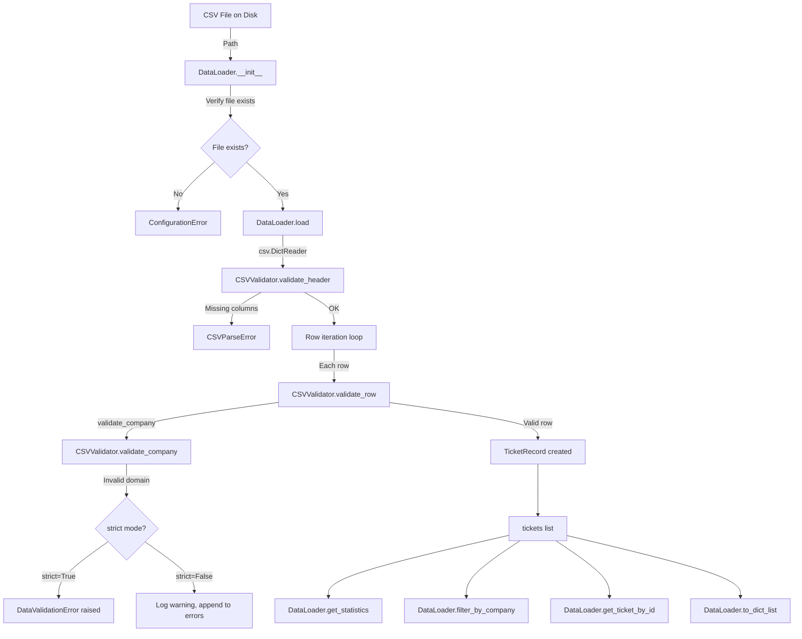
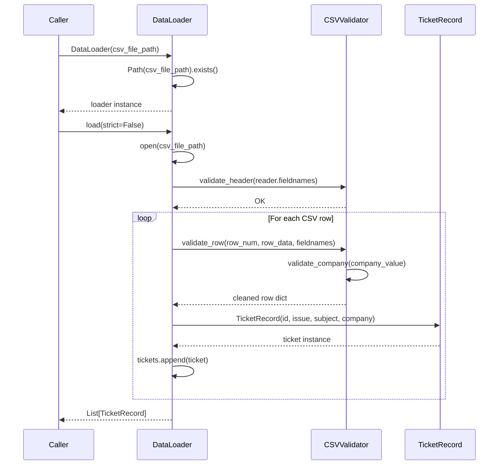
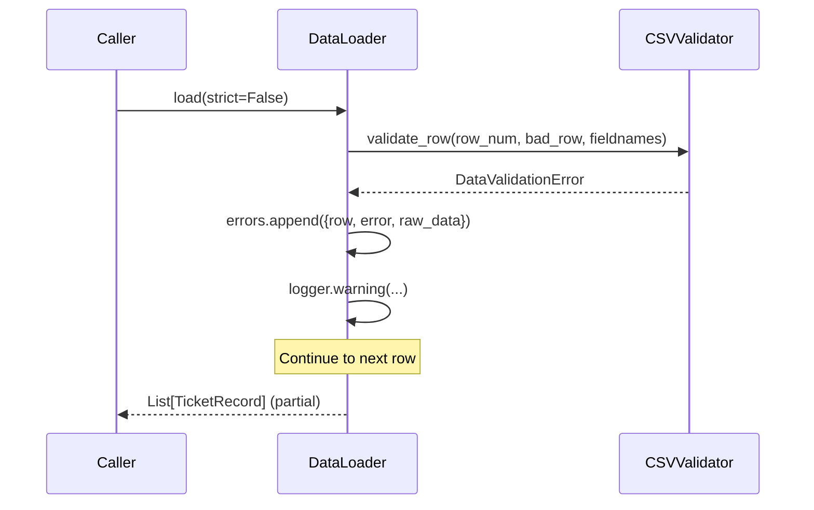

# Design Document: Support Ticket Triage Data Loader

## Overview

The `data_loader.py` module provides a production-grade CSV ingestion pipeline for support ticket data. It reads structured CSV files, validates each row against the domain configuration defined in `config.py`, and exposes clean `TicketRecord` dataclass instances to downstream consumers. The module is designed to fail fast on structural errors (missing columns, missing file) while tolerating row-level validation failures by default, logging warnings and continuing rather than aborting the entire load.

The module integrates directly with `config.py` constants (`SUPPORTED_DOMAINS`, `CONFIDENCE_MIN`, `CONFIDENCE_HIGH`, etc.) and has no third-party runtime dependencies beyond the Python standard library.

---

## Architecture



---

## Sequence Diagrams

### Happy Path: Loading a Valid CSV



### Error Path: Row Validation Failure (strict=False)



---

## Components and Interfaces

### Component 1: TicketRecord (Dataclass)

**Purpose**: Immutable value object representing a single validated support ticket.

**Interface**:
```python
@dataclass
class TicketRecord:
    id: int                    # positive integer row identifier (1-based)
    issue: str                 # non-empty issue text
    subject: str = ""          # optional subject line
    company: Optional[str] = None  # canonical domain or None

    def __post_init__(self) -> None: ...
    def clean(self) -> "TicketRecord": ...
    def to_dict(self) -> dict: ...
    def __repr__(self) -> str: ...
```

**Responsibilities**:
- Enforce field invariants at construction time (`__post_init__`)
- Provide whitespace-normalised copy via `clean()`
- Serialise to plain dict via `to_dict()` for downstream consumers

---

### Component 2: CSVValidator

**Purpose**: Validates CSV structure (header) and individual row content against config-defined rules.

**Interface**:
```python
class CSVValidator:
    def __init__(self, cfg=None) -> None: ...
    def validate_header(self, fieldnames: list) -> None: ...
    def validate_row(self, row_num: int, row_data: dict, fieldnames: list) -> dict: ...
    def validate_company(self, company_value: str) -> Optional[str]: ...
```

**Responsibilities**:
- Assert required columns (`Issue`, `Subject`, `Company`) are present
- Validate `Issue` is non-empty after stripping
- Normalise and validate `Company` against `SUPPORTED_DOMAINS`
- Accept extra columns silently (forward-compatible)

---

### Component 3: DataLoader

**Purpose**: Orchestrates file I/O, delegates validation, accumulates results and error statistics.

**Interface**:
```python
class DataLoader:
    def __init__(self, csv_file_path, cfg=None) -> None: ...
    def load(self, strict: bool = False) -> list[TicketRecord]: ...
    def get_statistics(self) -> dict: ...
    def filter_by_company(self, company: Optional[str]) -> list[TicketRecord]: ...
    def get_ticket_by_id(self, ticket_id: int) -> Optional[TicketRecord]: ...
    def to_dict_list(self) -> list[dict]: ...
```

**Responsibilities**:
- Verify file existence at init time (fail fast)
- Manage the full load lifecycle: open → validate header → iterate rows → collect results
- Support both lenient (`strict=False`) and strict (`strict=True`) error modes
- Expose query methods for filtering and lookup after load

---

### Component 4: Utility Functions (module-level)

**Purpose**: Convenience wrappers and pure helper functions for common operations.

**Interface**:
```python
def load_tickets(csv_path, cfg=None, strict: bool = False) -> list[TicketRecord]: ...
def normalize_company(company_str) -> Optional[str]: ...
def sanitize_ticket_text(text: str) -> str: ...
```

**Responsibilities**:
- `load_tickets`: One-call convenience wrapper (create loader + load)
- `normalize_company`: Case-insensitive domain lookup, returns `None` for unrecognised values (does not raise)
- `sanitize_ticket_text`: Strip, normalise line endings, collapse internal whitespace

---

## Data Models

### TicketRecord Fields

| Field     | Type            | Constraints                                      |
|-----------|-----------------|--------------------------------------------------|
| `id`      | `int`           | Positive integer (> 0), 1-based row number       |
| `issue`   | `str`           | Non-empty after stripping whitespace             |
| `subject` | `str`           | Optional, may be empty string (default `""`)     |
| `company` | `Optional[str]` | One of `SUPPORTED_DOMAINS` or `None`             |

### Statistics Dict

```python
{
    "total_rows_read":      int,    # all data rows encountered
    "valid_tickets_loaded": int,    # rows that passed validation
    "error_count":          int,    # rows that failed validation
    "success_rate":         float,  # (valid / total) * 100, range [0.0, 100.0]
    "errors":               list,   # list of {row, error, raw_data} dicts
}
```

### Error Detail Dict

```python
{
    "row":      int,   # 1-based row number
    "error":    str,   # human-readable error message
    "raw_data": dict,  # original unmodified row dict from csv.DictReader
}
```

---

## Custom Exception Hierarchy

```
Exception
└── DataLoadError          # base for all module exceptions
    ├── CSVParseError      # structural CSV issues (bad header, empty file)
    ├── DataValidationError # row-level data rule violations
    └── ConfigurationError  # loader misconfiguration (file not found)
```

---

## Key Functions with Formal Specifications

### `CSVValidator.validate_header(fieldnames)`

**Preconditions:**
- `fieldnames` is a list (may be `None` for empty files)

**Postconditions:**
- Returns `None` if all required columns are present
- Raises `CSVParseError` if `fieldnames` is `None` or any required column is missing
- Extra columns beyond the required set are silently accepted

**Loop Invariants:** N/A (set difference operation)

---

### `CSVValidator.validate_row(row_num, row_data, fieldnames)`

**Preconditions:**
- `row_num` is a positive integer
- `row_data` is a dict with at least the required column keys
- `fieldnames` is a non-empty list

**Postconditions:**
- Returns a cleaned copy of `row_data` with normalised field values
- `cleaned["Issue"]` is a non-empty stripped string
- `cleaned["Company"]` is a canonical domain string or `None`
- Raises `DataValidationError` if `Issue` is empty or `Company` is unrecognised

---

### `DataLoader.load(strict)`

**Preconditions:**
- `self.csv_file_path` exists on disk (guaranteed by `__init__`)
- `strict` is a boolean

**Postconditions:**
- Returns a list of `TicketRecord` objects (may be empty)
- `self.total_rows` equals the number of data rows in the CSV
- `self.valid_rows` equals `len(self.tickets)`
- `len(self.errors)` equals `self.total_rows - self.valid_rows`
- If `strict=True` and any row fails: raises `DataValidationError` immediately
- If `strict=False`: all valid rows are collected; invalid rows are logged and skipped

**Loop Invariants:**
- At each iteration: `self.valid_rows + len(self.errors) == rows_processed_so_far`
- All tickets in `self.tickets` are valid `TicketRecord` instances

---

### `normalize_company(company_str)`

**Preconditions:**
- `company_str` is a string or `None`

**Postconditions:**
- Returns `None` for `None`, empty string, or the literal `"None"`
- Returns the canonical lowercase domain string for a case-insensitive match
- Returns `None` for unrecognised values (does NOT raise)
- Idempotent: `normalize_company(normalize_company(x)) == normalize_company(x)`

---

### `sanitize_ticket_text(text)`

**Preconditions:**
- `text` is a string (may be empty)

**Postconditions:**
- Returns a string with length ≤ `len(text)` (never increases length)
- Leading/trailing whitespace is stripped
- Line endings are normalised to `\n`
- Internal runs of spaces/tabs within each line are collapsed to a single space
- Empty input returns empty string

---

## Algorithmic Pseudocode

### Main Load Algorithm

```pascal
ALGORITHM DataLoader.load(strict)
INPUT: strict: boolean
OUTPUT: tickets: list of TicketRecord

BEGIN
  RESET self.tickets, self.total_rows, self.valid_rows, self.errors

  OPEN self.csv_file_path AS fh
  reader ← csv.DictReader(fh)

  CALL validate_header(reader.fieldnames)  // raises CSVParseError if invalid

  FOR each (row_num, row) IN enumerate(reader, start=1) DO
    // Loop invariant: valid_rows + len(errors) == row_num - 1
    self.total_rows ← self.total_rows + 1

    TRY
      cleaned ← validate_row(row_num, row, reader.fieldnames)
      ticket ← TicketRecord(id=row_num, issue=cleaned["Issue"],
                             subject=cleaned["Subject"],
                             company=cleaned["Company"])
      self.tickets.append(ticket)
      self.valid_rows ← self.valid_rows + 1

    CATCH DataValidationError AS exc
      IF strict THEN
        RAISE exc
      END IF
      self.errors.append({row: row_num, error: str(exc), raw_data: row})
      LOG warning
    END TRY
  END FOR

  ASSERT self.valid_rows + len(self.errors) == self.total_rows

  RETURN self.tickets
END
```

### Company Validation Algorithm

```pascal
ALGORITHM validate_company(company_value)
INPUT: company_value: string or None
OUTPUT: canonical_domain: string or None

BEGIN
  IF company_value IS None THEN
    RETURN None
  END IF

  stripped ← company_value.strip()

  IF stripped == "" OR stripped.lower() == "none" THEN
    RETURN None
  END IF

  lower ← stripped.lower()

  FOR each domain IN SUPPORTED_DOMAINS DO
    IF lower == domain.lower() THEN
      RETURN domain  // canonical lowercase value
    END IF
  END FOR

  RAISE DataValidationError("Company value not a supported domain")
END
```

### Text Sanitization Algorithm

```pascal
ALGORITHM sanitize_ticket_text(text)
INPUT: text: string
OUTPUT: cleaned: string

BEGIN
  IF text IS empty THEN
    RETURN ""
  END IF

  result ← text.strip()
  result ← result.replace("\r\n", "\n").replace("\r", "\n")

  lines ← result.split("\n")
  FOR each line IN lines DO
    line ← collapse_horizontal_whitespace(line).strip()
  END FOR

  RETURN join(lines, "\n")
END
```

---

## Error Handling

### Error Scenario 1: File Not Found

**Condition**: `csv_file_path` does not exist when `DataLoader.__init__` is called.
**Response**: Raises `ConfigurationError` with a descriptive message including the path.
**Recovery**: Caller must provide a valid file path before retrying.

### Error Scenario 2: Missing Required CSV Column

**Condition**: The CSV header is missing one or more of `Issue`, `Subject`, `Company`.
**Response**: Raises `CSVParseError` listing the missing columns and the columns found.
**Recovery**: The CSV file must be corrected before loading can proceed.

### Error Scenario 3: Empty Issue Field (strict=False)

**Condition**: A row has an empty or whitespace-only `Issue` field.
**Response**: Logs a warning, appends error detail to `self.errors`, skips the row.
**Recovery**: Automatic — loading continues with remaining rows.

### Error Scenario 4: Unrecognised Company Value (strict=False)

**Condition**: A row's `Company` field is non-empty but not in `SUPPORTED_DOMAINS`.
**Response**: Logs a warning, appends error detail to `self.errors`, skips the row.
**Recovery**: Automatic — loading continues with remaining rows.

### Error Scenario 5: Any Validation Error (strict=True)

**Condition**: Any row fails validation when `strict=True`.
**Response**: Raises `DataValidationError` immediately, halting the load.
**Recovery**: Caller must handle the exception; partial results are not returned.

---

## Testing Strategy

### Unit Testing Approach

Tests are organised into four classes in `test_data_loader.py`:

- **TestCSVValidator** (7 tests): header validation (valid, missing column, extra columns), company validation (valid domains, invalid domain, None/empty), row validation (empty issue).
- **TestTicketRecord** (5 tests): creation, negative/zero id, empty/whitespace issue, `clean()`, `to_dict()`.
- **TestDataLoader** (9 tests): file not found, valid init, load valid CSV, load with errors strict=False, load with errors strict=True, statistics, filter by company, get by id, to_dict_list.
- **TestUtilityFunctions** (8 tests): `load_tickets` convenience, `normalize_company` valid/invalid/None, `sanitize_ticket_text` whitespace/newlines/empty/tabs.

### Property-Based Testing Approach

**Property Test Library**: `hypothesis`

Five properties verified in `test_data_loader_properties.py`:

1. **Round-trip serialization**: `TicketRecord → to_dict() → reconstruct` preserves all field values.
2. **Sanitization never increases length**: `len(sanitize_ticket_text(s)) <= len(s)` for all strings.
3. **Company normalization is idempotent**: `normalize_company(normalize_company(x)) == normalize_company(x)`.
4. **Statistics invariants**: `valid <= total`, `errors == total - valid`, `0 <= success_rate <= 100`.
5. **Filtering is non-generative**: filtered count ≤ total, all filtered tickets match the condition, filtered tickets are a subset of loaded tickets by id.

### Integration Testing Approach

The `inputs/sample_support_tickets.csv` file serves as an integration fixture, exercising the full pipeline from file I/O through validation to `TicketRecord` construction with real-world data across all three supported domains.

---

## Performance Considerations

- The module processes CSV files row-by-row using `csv.DictReader`, keeping memory usage proportional to the number of valid tickets (not the file size).
- `load()` can be called multiple times on the same `DataLoader` instance; state is reset at the start of each call.
- `filter_by_company()` and `get_ticket_by_id()` perform linear scans over `self.tickets`. For very large datasets (> 100k tickets), callers should consider building an index after loading.

---

## Security Considerations

- File paths are resolved via `pathlib.Path` to prevent directory traversal issues.
- No user-supplied data is executed or evaluated; all input is treated as plain text.
- The module does not write to disk, make network calls, or execute subprocesses.
- Logging uses `%`-style formatting (not f-strings) to prevent log injection.

---

## Dependencies

| Dependency   | Source           | Purpose                                      |
|--------------|------------------|----------------------------------------------|
| `csv`        | Python stdlib    | CSV parsing via `DictReader`                 |
| `os`         | Python stdlib    | OS-level utilities                           |
| `sys`        | Python stdlib    | System-level utilities                       |
| `re`         | Python stdlib    | Regex for whitespace collapsing              |
| `logging`    | Python stdlib    | Structured logging with console handler      |
| `pathlib`    | Python stdlib    | Path resolution and existence checks         |
| `dataclasses`| Python stdlib    | `@dataclass` decorator for `TicketRecord`    |
| `typing`     | Python stdlib    | `Optional` type annotation                   |
| `config`     | Local module     | `SUPPORTED_DOMAINS` and other constants      |
| `pytest`     | Test dependency  | Unit test runner                             |
| `hypothesis` | Test dependency  | Property-based test generation               |
