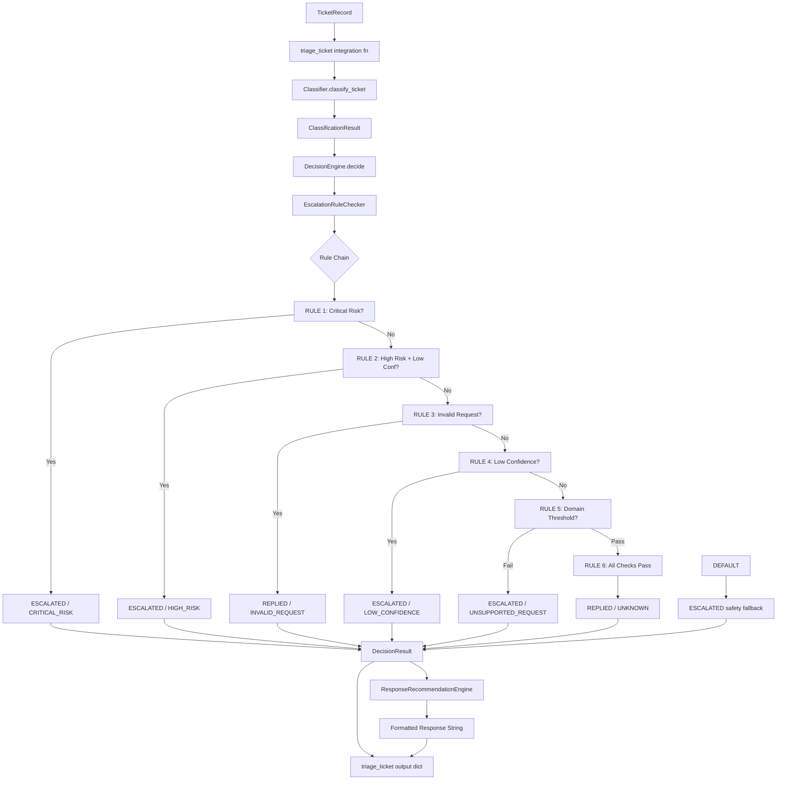
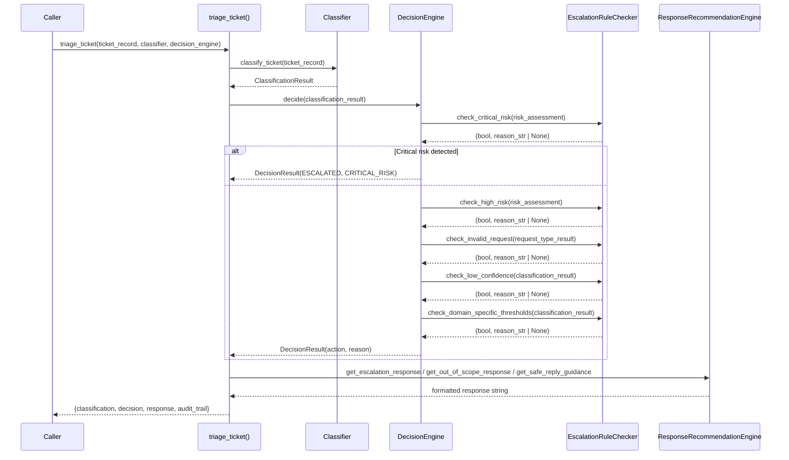
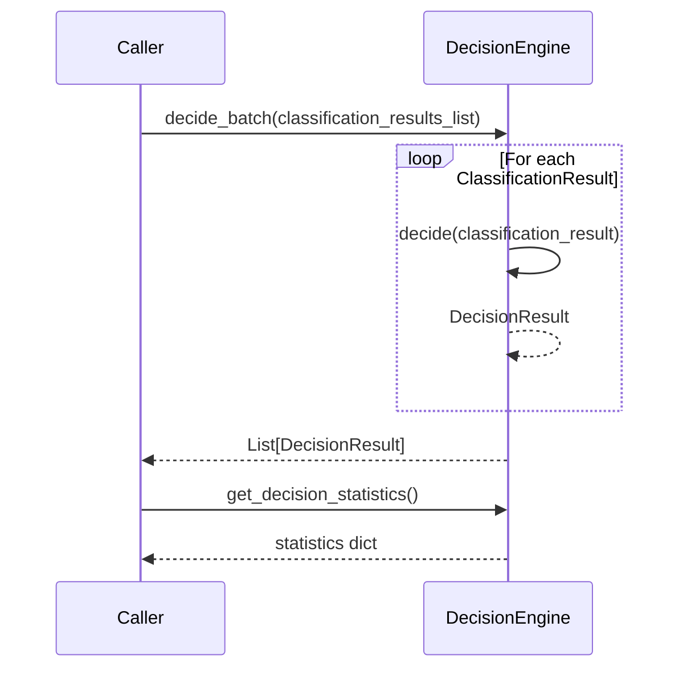

# Design Document: Support Ticket Triage Decision Engine

## Overview

The `decision_engine.py` module is the production-grade routing layer of the support ticket triage system. It consumes `ClassificationResult` objects produced by `classifier.py` and applies a deterministic, priority-ordered rule chain to decide whether a ticket should receive an automated reply (`REPLIED`) or be escalated to a human agent (`ESCALATED`). The module is safety-first: when in doubt, it escalates rather than risks an incorrect automated response.

The engine integrates with all three upstream modules: `config.py` (confidence thresholds, domain constants, template responses), `data_loader.py` (`TicketRecord` for the integration function), and `classifier.py` (all classification result types). It exposes a `DecisionEngine` class for single and batch decisions, an `EscalationRuleChecker` for modular rule evaluation, a `ResponseRecommendationEngine` for generating formatted responses, and a top-level `triage_ticket` integration function that orchestrates the full pipeline from raw ticket to final response.

Every decision is accompanied by a complete audit trail — a structured dict capturing the inputs, triggered rules, confidence values, and final action — enabling full traceability for compliance and debugging.

---

## Architecture



---

## Sequence Diagrams

### Single Ticket Triage (Full Pipeline)



### Batch Decision Processing



---

## Components and Interfaces

### Component 1: Enums and Constants

**Purpose**: Provide type-safe action and reason values, plus priority-ordered rule constants and domain-specific confidence thresholds.

**Interface**:
```python
class TriageAction(Enum):
    REPLIED = "replied"
    ESCALATED = "escalated"

class EscalationReason(Enum):
    CRITICAL_RISK = "critical_risk"
    HIGH_RISK = "high_risk"
    LOW_CONFIDENCE = "low_confidence"
    UNSUPPORTED_REQUEST = "unsupported_request"
    MULTI_ISSUE = "multi_issue"
    INVALID_REQUEST = "invalid_request"
    UNKNOWN = "unknown"

ESCALATION_RULE_PRIORITY_ORDER: list  # [RiskLevel.CRITICAL, RiskLevel.HIGH, RequestType.INVALID, ...]

DOMAIN_SPECIFIC_ESCALATION_THRESHOLDS: dict = {
    "hackerrank": {"billing": 0.95, "account": 0.98, "assessments": 0.8},
    "claude":     {"api": 0.85, "subscription": 0.95, "account": 0.98},
    "visa":       {"payments": 0.95, "refunds": 0.98, "disputes": 0.98},
}
```

**Responsibilities**:
- Prevent magic-string bugs in decision logic
- Document the priority order of escalation rules
- Encode domain-specific confidence requirements for sensitive product areas

---

### Component 2: DecisionResult Dataclass

**Purpose**: Typed, structured value object carrying the complete output of a single triage decision.

**Interface**:
```python
@dataclass
class DecisionResult:
    action: TriageAction
    confidence: float
    reason: EscalationReason
    reasoning_text: str
    triggered_rules: list[str]
    suggested_response: str
    domain: Domain
    request_type: RequestType
    risk_level: RiskLevel
    audit_trail: dict

    def __repr__(self) -> str: ...
    def to_dict(self) -> dict: ...
    def is_safe_to_reply(self) -> bool:
        # True if action == REPLIED and confidence >= CONFIDENCE_HIGH
        ...
```

**Responsibilities**:
- Carry all decision output in a structured, inspectable form
- Provide `to_dict()` for serialisation to downstream consumers and audit logs
- Expose `is_safe_to_reply()` as a convenience predicate for callers
- Expose `__repr__` for logging and debugging

---

### Component 3: EscalationRuleChecker

**Purpose**: Modular, single-responsibility rule evaluators. Each method checks exactly one escalation condition and returns a `(triggered: bool, reason_text: str | None)` tuple.

**Interface**:
```python
class EscalationRuleChecker:
    def check_critical_risk(self, risk_assessment: RiskAssessment) -> tuple[bool, str | None]: ...
    def check_high_risk(self, risk_assessment: RiskAssessment) -> tuple[bool, str | None]: ...
    def check_invalid_request(self, request_type_result: RequestTypeResult) -> tuple[bool, str | None]: ...
    def check_low_confidence(self, classification_result: ClassificationResult) -> tuple[bool, str | None]: ...
    def check_domain_specific_thresholds(self, classification_result: ClassificationResult) -> tuple[bool, str | None]: ...
    def check_multi_issue_ticket(self, ticket_text: str) -> tuple[bool, str | None]: ...
```

**Responsibilities**:
- Isolate each business rule so it can be tested independently
- Return `(False, None)` when the rule does not trigger
- Return `(True, human_readable_reason)` when the rule triggers
- Never raise exceptions for expected inputs

---

### Component 4: DecisionEngine

**Purpose**: Orchestrates the rule chain, accumulates statistics, and produces `DecisionResult` objects.

**Interface**:
```python
class DecisionEngine:
    def decide(self, classification_result: ClassificationResult) -> DecisionResult: ...
    def decide_batch(self, classification_results_list: list) -> list[DecisionResult]: ...
    def get_decision_statistics(self) -> dict: ...
    def get_decision_confidence_stats(self) -> dict: ...
```

**Responsibilities**:
- Apply escalation rules in strict priority order (RULE 1 → RULE 6 → DEFAULT)
- Build the complete `DecisionResult` including audit trail
- Accumulate per-action, per-reason, and per-risk-level counters
- Collect confidence values for statistical reporting

---

### Component 5: ResponseRecommendationEngine

**Purpose**: Generate formatted, human-readable response strings for each decision outcome.

**Interface**:
```python
class ResponseRecommendationEngine:
    def get_escalation_response(self, decision_result: DecisionResult, ticket_id: str) -> str: ...
    def get_out_of_scope_response(self, decision_result: DecisionResult, ticket_id: str) -> str: ...
    def get_safe_reply_guidance(self, decision_result: DecisionResult) -> str: ...
```

**Responsibilities**:
- Format `TEMPLATE_RESPONSES["escalation"]` with `{ticket_id}`, `{domain}`, `{agent_name}`
- Format `TEMPLATE_RESPONSES["out_of_scope"]` with `{ticket_id}`, `{domain}`
- Build contextual guidance strings for safe-reply decisions based on product area and request type
- Never raise exceptions; always return a non-empty string

---

### Component 6: triage_ticket Integration Function

**Purpose**: Top-level convenience function that orchestrates the full pipeline from raw `TicketRecord` to final response dict.

**Interface**:
```python
def triage_ticket(
    ticket_record: TicketRecord,
    classifier: Classifier,
    decision_engine: DecisionEngine,
) -> dict: ...
```

**Responsibilities**:
- Call `classifier.classify_ticket(ticket_record)` to produce `ClassificationResult`
- Call `decision_engine.decide(classification_result)` to produce `DecisionResult`
- Select and generate the appropriate response via `ResponseRecommendationEngine`
- Return a unified dict with keys: `classification`, `decision`, `response`, `audit_trail`

---

## Data Models

### DecisionResult Fields

| Field              | Type               | Description                                                  |
|--------------------|--------------------|--------------------------------------------------------------|
| `action`           | `TriageAction`     | Final routing decision: REPLIED or ESCALATED                 |
| `confidence`       | `float`            | Confidence in the decision, in `[0.0, 1.0]`                  |
| `reason`           | `EscalationReason` | Enum value identifying which rule triggered the decision     |
| `reasoning_text`   | `str`              | Human-readable explanation of the decision                   |
| `triggered_rules`  | `list[str]`        | Ordered list of rule names that were evaluated               |
| `suggested_response` | `str`            | Pre-formatted response text for the ticket submitter         |
| `domain`           | `Domain`           | Domain from the classification result                        |
| `request_type`     | `RequestType`      | Request type from the classification result                  |
| `risk_level`       | `RiskLevel`        | Risk level from the classification result                    |
| `audit_trail`      | `dict`             | Full structured record of inputs, rules, and outputs         |

### Decision Statistics Dict

```python
{
    "total_decisions":      int,    # total calls to decide() since init
    "replied_count":        int,    # decisions with action == REPLIED
    "escalated_count":      int,    # decisions with action == ESCALATED
    "escalation_rate":      float,  # escalated_count / total_decisions * 100
    "by_reason":            dict,   # {EscalationReason.value: count}
    "critical_risk_count":  int,    # decisions triggered by CRITICAL_RISK
    "high_risk_count":      int,    # decisions triggered by HIGH_RISK
    "low_confidence_count": int,    # decisions triggered by LOW_CONFIDENCE
}
```

### Decision Confidence Stats Dict

```python
{
    "min_confidence":    float,
    "max_confidence":    float,
    "avg_confidence":    float,
    "median_confidence": float,
    "std_dev":           float,
}
```

### Audit Trail Dict Structure

```python
{
    "ticket_domain":        str,    # domain.value
    "ticket_request_type":  str,    # request_type.value
    "ticket_risk_level":    str,    # risk_level.value
    "avg_confidence":       float,  # average of classification confidences
    "rules_evaluated":      list,   # ordered list of rule names checked
    "triggered_rule":       str,    # name of the rule that fired
    "final_action":         str,    # action.value
    "final_reason":         str,    # reason.value
    "decision_confidence":  float,  # confidence of the final decision
}
```

### Domain-Specific Escalation Thresholds

| Domain      | Product Area  | Required Confidence |
|-------------|---------------|---------------------|
| hackerrank  | billing       | 0.95                |
| hackerrank  | account       | 0.98                |
| hackerrank  | assessments   | 0.80                |
| claude      | api           | 0.85                |
| claude      | subscription  | 0.95                |
| claude      | account       | 0.98                |
| visa        | payments      | 0.95                |
| visa        | refunds       | 0.98                |
| visa        | disputes      | 0.98                |

---

## Error Handling

### Error Scenario 1: Classification Result with Unexpected Values

**Condition**: `decide()` receives a `ClassificationResult` with an unrecognised enum value.
**Response**: The DEFAULT safety fallback fires, producing `ESCALATED` with `EscalationReason.UNKNOWN`.
**Recovery**: Automatic — the safety-first default ensures no ticket is silently dropped.

### Error Scenario 2: Template Formatting Failure

**Condition**: `ResponseRecommendationEngine` cannot format a template (e.g. missing placeholder key).
**Response**: Returns a generic fallback string rather than raising.
**Recovery**: Caller always receives a non-empty string response.

### Error Scenario 3: Empty Batch Input

**Condition**: `decide_batch([])` is called with an empty list.
**Response**: Returns an empty list without raising.
**Recovery**: Automatic — statistics remain unchanged.

### Error Scenario 4: Confidence Stats on Zero Decisions

**Condition**: `get_decision_confidence_stats()` is called before any decisions have been made.
**Response**: Returns a dict with all values set to `0.0`.
**Recovery**: Automatic — no division-by-zero error.

---

## Testing Strategy

### Unit Testing Approach

Tests are organised into five classes in `test_decision_engine.py` (18+ tests total):

- **TestEscalationRuleChecker** (5 tests): critical risk triggers, high risk triggers, invalid request triggers, low confidence triggers, multi-issue detection.
- **TestDecisionEngine** (9 tests): critical always escalates, high risk + low confidence escalates, invalid request replies, low confidence escalates, high confidence + low risk replies, reasoning text populated, domain-specific thresholds, batch decisions, statistics.
- **TestDecisionResult** (3 tests): `to_dict()` structure, `is_safe_to_reply()` predicate, `__repr__` output.
- **TestResponseRecommendationEngine** (3 tests): escalation response formatting, out-of-scope response formatting, safe reply guidance content.
- **TestIntegration** (3 tests): full pipeline via `triage_ticket`, critical ticket escalates end-to-end, safe ticket replies end-to-end.

### Property-Based Testing Approach

**Property Test Library**: `hypothesis`

Six properties verified in `test_decision_engine_properties.py`:

1. **Decision validity**: Every `DecisionResult` has a valid `TriageAction`, `EscalationReason`, and confidence in `[0.0, 1.0]`.
2. **Critical risk invariant**: Any `ClassificationResult` with `RiskLevel.CRITICAL` always produces `ESCALATED` with `confidence == 1.0`.
3. **Invalid request invariant**: Any `ClassificationResult` with `RequestType.INVALID` always produces `REPLIED` with `EscalationReason.INVALID_REQUEST`.
4. **Batch order preservation**: `decide_batch(results)` returns decisions in the same order as the input list.
5. **Statistics invariants**: `replied_count + escalated_count == total_decisions` and `0 <= escalation_rate <= 100`.
6. **Response formatting safety**: `get_escalation_response`, `get_out_of_scope_response`, and `get_safe_reply_guidance` never raise and always return non-empty strings.

### Integration Testing Approach

The `triage_ticket` function is tested end-to-end using real `TicketRecord` fixtures loaded from `inputs/sample_support_tickets.csv`, verifying that the full pipeline (load → classify → decide → respond) produces valid output dicts with all required keys.

---

## Performance Considerations

- All rule checks are O(1) or O(k) where k is the number of domain-specific threshold entries (≤ 9 total). Decision latency is negligible.
- `decide_batch` processes decisions sequentially; for very large batches, callers may parallelise using `concurrent.futures.ThreadPoolExecutor`.
- Statistics accumulation uses simple integer counters and list appends — no locking is required for single-threaded use.
- `get_decision_confidence_stats()` computes statistics lazily on each call; for very high-volume systems, consider caching the result.

---

## Security Considerations

- No user-supplied data is executed or evaluated; all input is treated as plain text.
- The module does not write to disk, make network calls, or execute subprocesses.
- Template formatting uses `.format()` with known keys only — no `eval` or `exec`.
- Audit trail dicts contain only serialisable primitive types (strings, floats, lists) — safe for JSON serialisation.
- The safety-first DEFAULT rule ensures that any unexpected classification state results in escalation rather than an automated reply.

---

## Dependencies

| Dependency    | Source        | Purpose                                                          |
|---------------|---------------|------------------------------------------------------------------|
| `logging`     | Python stdlib | Structured logging with console handler                          |
| `enum`        | Python stdlib | `Enum` base class for `TriageAction`, `EscalationReason`         |
| `dataclasses` | Python stdlib | `@dataclass` decorator for `DecisionResult`                      |
| `typing`      | Python stdlib | `Optional`, `List`, `Tuple` type annotations                     |
| `statistics`  | Python stdlib | `mean`, `median`, `stdev` for confidence stats                   |
| `config`      | Local module  | `CONFIDENCE_MIN`, `CONFIDENCE_HIGH`, `SUPPORTED_DOMAINS`, `TEMPLATE_RESPONSES` |
| `classifier`  | Local module  | `RequestType`, `RiskLevel`, `Domain`, `ClassificationResult`, `RequestTypeResult`, `ProductAreaResult`, `RiskAssessment` |
| `data_loader` | Local module  | `TicketRecord`                                                   |
| `pytest`      | Test dep      | Unit test runner                                                 |
| `hypothesis`  | Test dep      | Property-based test generation                                   |

---

## Key Functions with Formal Specifications

### `DecisionEngine.decide(classification_result)`

**Preconditions:**
- `classification_result` is a valid `ClassificationResult` instance
- All nested result objects (`request_type`, `product_area`, `risk`) are non-None

**Postconditions:**
- Returns a `DecisionResult` with a valid `TriageAction` and `EscalationReason`
- `confidence` is in `[0.0, 1.0]`
- `triggered_rules` is a non-empty list of rule name strings
- `audit_trail` is a non-empty dict with all required keys
- If `risk.level == CRITICAL` → `action == ESCALATED` and `confidence == 1.0`
- If `request_type.type == INVALID` → `action == REPLIED` and `reason == INVALID_REQUEST`
- DEFAULT case always produces `action == ESCALATED` (safety-first)

**Loop Invariants:** N/A (sequential rule chain, no loops)

---

### `EscalationRuleChecker.check_low_confidence(classification_result)`

**Preconditions:**
- `classification_result` is a valid `ClassificationResult`

**Postconditions:**
- Returns `(True, reason_str)` if average confidence across all classification dimensions < `CONFIDENCE_MIN`
- Returns `(False, None)` otherwise
- `reason_str` includes the computed average confidence value formatted to 2 decimal places

**Loop Invariants:** N/A

---

### `EscalationRuleChecker.check_domain_specific_thresholds(classification_result)`

**Preconditions:**
- `classification_result` is a valid `ClassificationResult`
- `DOMAIN_SPECIFIC_ESCALATION_THRESHOLDS` is non-empty

**Postconditions:**
- Returns `(True, reason_str)` if the domain is in `DOMAIN_SPECIFIC_ESCALATION_THRESHOLDS` AND the product area is in the domain's threshold map AND the average confidence < the required threshold
- Returns `(False, None)` if the domain is not in the threshold map, or the area is not in the domain's map, or confidence meets the threshold

**Loop Invariants:** N/A

---

### `ResponseRecommendationEngine.get_safe_reply_guidance(decision_result)`

**Preconditions:**
- `decision_result` is a valid `DecisionResult` with `action == REPLIED`

**Postconditions:**
- Returns a non-empty string
- String includes the product area name
- String includes the request type value
- String includes the confidence value
- Never raises an exception

**Loop Invariants:** N/A

---

## Algorithmic Pseudocode

### Main Decision Algorithm

```pascal
ALGORITHM DecisionEngine.decide(classification_result)
INPUT: classification_result: ClassificationResult
OUTPUT: result: DecisionResult

BEGIN
  risk       ← classification_result.risk
  req_type   ← classification_result.request_type
  domain     ← classification_result.detected_domain
  avg_conf   ← mean(risk.confidence, req_type.confidence, classification_result.product_area.confidence)
  rules_eval ← []

  // RULE 1: Critical risk — always escalate, highest priority
  rules_eval.append("check_critical_risk")
  IF risk.level == CRITICAL THEN
    LOG WARNING "Critical risk ticket — escalating"
    RETURN build_result(ESCALATED, 1.0, CRITICAL_RISK, rules_eval, classification_result)
  END IF

  // RULE 2: High risk + low confidence — escalate
  rules_eval.append("check_high_risk")
  IF risk.level == HIGH AND avg_conf < CONFIDENCE_HIGH THEN
    LOG INFO "High risk + low confidence — escalating"
    RETURN build_result(ESCALATED, avg_conf, HIGH_RISK, rules_eval, classification_result)
  END IF

  // RULE 3: Invalid request — reply with out-of-scope template
  rules_eval.append("check_invalid_request")
  IF req_type.type == INVALID THEN
    RETURN build_result(REPLIED, 0.8, INVALID_REQUEST, rules_eval, classification_result)
  END IF

  // RULE 4: Low confidence — escalate
  rules_eval.append("check_low_confidence")
  IF avg_conf < CONFIDENCE_MIN THEN
    LOG INFO "Low confidence ({avg_conf:.2f}) — escalating"
    RETURN build_result(ESCALATED, avg_conf, LOW_CONFIDENCE, rules_eval, classification_result)
  END IF

  // RULE 5: Domain-specific threshold not met — escalate
  rules_eval.append("check_domain_specific_thresholds")
  threshold ← DOMAIN_SPECIFIC_ESCALATION_THRESHOLDS[domain.value][product_area.area]
  IF threshold EXISTS AND avg_conf < threshold THEN
    RETURN build_result(ESCALATED, avg_conf, UNSUPPORTED_REQUEST, rules_eval, classification_result)
  END IF

  // RULE 6: All checks pass — safe to reply
  rules_eval.append("all_checks_passed")
  LOG DEBUG "All checks passed — replying"
  RETURN build_result(REPLIED, avg_conf, UNKNOWN, rules_eval, classification_result)

  // DEFAULT: Safety fallback (should not be reached in normal flow)
  RETURN build_result(ESCALATED, 0.0, UNKNOWN, rules_eval, classification_result)
END
```

### EscalationRuleChecker Algorithms

```pascal
ALGORITHM check_critical_risk(risk_assessment)
INPUT: risk_assessment: RiskAssessment
OUTPUT: (triggered: bool, reason: str | None)

BEGIN
  IF risk_assessment.level == RiskLevel.CRITICAL THEN
    RETURN (True, "Critical risk detected")
  END IF
  RETURN (False, None)
END

ALGORITHM check_high_risk(risk_assessment)
INPUT: risk_assessment: RiskAssessment
OUTPUT: (triggered: bool, reason: str | None)

BEGIN
  IF risk_assessment.level == RiskLevel.HIGH THEN
    reason ← "High risk detected: " + risk_assessment.reason
    RETURN (True, reason)
  END IF
  RETURN (False, None)
END

ALGORITHM check_invalid_request(request_type_result)
INPUT: request_type_result: RequestTypeResult
OUTPUT: (triggered: bool, reason: str | None)

BEGIN
  IF request_type_result.type == RequestType.INVALID THEN
    RETURN (True, "Invalid/out-of-scope request")
  END IF
  RETURN (False, None)
END

ALGORITHM check_low_confidence(classification_result)
INPUT: classification_result: ClassificationResult
OUTPUT: (triggered: bool, reason: str | None)

BEGIN
  confidences ← [
    classification_result.request_type.confidence,
    classification_result.product_area.confidence,
    classification_result.risk.confidence
  ]
  avg ← mean(confidences)

  IF avg < CONFIDENCE_MIN THEN
    RETURN (True, f"Low confidence ({avg:.2f})")
  END IF
  RETURN (False, None)
END

ALGORITHM check_domain_specific_thresholds(classification_result)
INPUT: classification_result: ClassificationResult
OUTPUT: (triggered: bool, reason: str | None)

BEGIN
  domain_key ← classification_result.detected_domain.value
  area_key   ← classification_result.product_area.area

  IF domain_key NOT IN DOMAIN_SPECIFIC_ESCALATION_THRESHOLDS THEN
    RETURN (False, None)
  END IF

  domain_thresholds ← DOMAIN_SPECIFIC_ESCALATION_THRESHOLDS[domain_key]

  IF area_key NOT IN domain_thresholds THEN
    RETURN (False, None)
  END IF

  required_threshold ← domain_thresholds[area_key]
  confidences ← [
    classification_result.request_type.confidence,
    classification_result.product_area.confidence,
    classification_result.risk.confidence
  ]
  avg ← mean(confidences)

  IF avg < required_threshold THEN
    reason ← f"Domain threshold not met for {domain_key}/{area_key}: {avg:.2f} < {required_threshold}"
    RETURN (True, reason)
  END IF
  RETURN (False, None)
END

ALGORITHM check_multi_issue_ticket(ticket_text)
INPUT: ticket_text: str
OUTPUT: (triggered: bool, reason: str | None)

BEGIN
  question_count ← count occurrences of "?" in ticket_text
  IF question_count > 3 THEN
    RETURN (True, "Ticket contains multiple issues")
  END IF
  RETURN (False, None)
END
```

### triage_ticket Integration Algorithm

```pascal
ALGORITHM triage_ticket(ticket_record, classifier, decision_engine)
INPUT: ticket_record: TicketRecord, classifier: Classifier, decision_engine: DecisionEngine
OUTPUT: result_dict: dict

BEGIN
  // Step 1: Classify
  classification_result ← classifier.classify_ticket(ticket_record)

  // Step 2: Decide
  decision_result ← decision_engine.decide(classification_result)

  // Step 3: Generate response
  rre ← ResponseRecommendationEngine()
  IF decision_result.action == ESCALATED THEN
    IF decision_result.reason == INVALID_REQUEST THEN
      response ← rre.get_out_of_scope_response(decision_result, ticket_record.id)
    ELSE
      response ← rre.get_escalation_response(decision_result, ticket_record.id)
    END IF
  ELSE
    response ← rre.get_safe_reply_guidance(decision_result)
  END IF

  // Step 4: Return unified result
  RETURN {
    "classification": classification_result.to_dict(),
    "decision":       decision_result.to_dict(),
    "response":       response,
    "audit_trail":    decision_result.audit_trail,
  }
END
```

### Confidence Statistics Algorithm

```pascal
ALGORITHM DecisionEngine.get_decision_confidence_stats()
INPUT: (none — uses internal _confidence_values list)
OUTPUT: stats: dict

BEGIN
  IF _confidence_values IS empty THEN
    RETURN {min: 0.0, max: 0.0, avg: 0.0, median: 0.0, std_dev: 0.0}
  END IF

  RETURN {
    "min_confidence":    min(_confidence_values),
    "max_confidence":    max(_confidence_values),
    "avg_confidence":    mean(_confidence_values),
    "median_confidence": median(_confidence_values),
    "std_dev":           stdev(_confidence_values) IF len >= 2 ELSE 0.0,
  }
END
```
